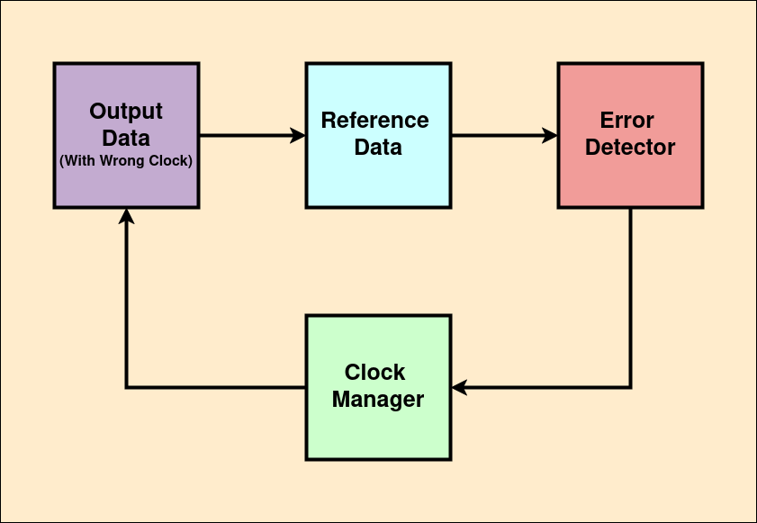

# Adaptive Clock Management

Modern hardware designs often require data alignment across varying clock domains or timing constraints. Manually selecting clock divider settings can be inefficient or suboptimal. This project implements a **hardware-level binary search algorithm** in **SystemVerilog** to find the optimal clock divider setting that eliminates timing errors during high-speed data transmission. It functions as a digital hardware feedback system that tunes its timing based on observed error feedback.
The binary search algorithm is used because it quickly narrows down the optimal clock divider value by repeatedly halving the search range, which means fewer steps compared to checking every possible setting one by one. This approach makes the state machine’s behavior predictable and easier to verify. Additionally, binary search logic is simple enough to implement in hardware. Integrating this algorithm into a finite state machine lets the system automatically adjust the clock divider based on error feedback, providing reliable timing without needing manual adjustments.

## Core Components

- **Clock Manager Module:**  
  Implements a **finite state machine (FSM)** to adjust a clock divider using binary search based on error feedback.

- **Random Data Generator:**  
  Generates pseudo-random or incrementing test patterns simulating incoming data under varying timing conditions.

- **Output Generator (Golden):**  
  Represents a correctly timed data output used as a reference to validate the current clock setting.

- **Error Detector:**  
  Compares the random data and the golden data. If mismatched, it asserts an `error_flag` which informs the clock manager.

## How It Works

1. The clock manager starts in an **IDLE** state, waiting for an error signal.
2. Upon detecting an error, it transitions to the **SEARCH** state.
3. A binary search algorithm runs on the clock divider (`clk_div`) to find an optimal value:
   - If error persists, increase the divider.
   - If no error after checking a specific number of data, the FSM enters the **VALIDATE** state.
4. When the optimal divider is found, the FSM enters the **FINISH** state and stops updating.

## Getting Started

1. **Open Vivado** and create a new project.

2. **Add Design Sources**:
   - Add all files from `hdl/src/`:
     - `clock_manager.sv`
     - `comparator.sv`
     - `output_gen.sv`
     - `random_clk_data_gen.sv`
   - Add `hdl/top.sv` and set it as the **Top Module**.

3. **Add Simulation Sources**:
   - Add `test/tb_top.sv` to the simulation sources.

4. **Run Simulation**:
   - Set `tb_top` as the simulation top module.
   - Run a behavioral simulation to verify the design.

## Potential Extensions

This binary search mechanism serves as a baseline. Possible improvements include:

- Using **Reinforcement Learning** or adaptive algorithms to learn optimal dividers dynamically.
- Extending to **multi-domain timing alignment**.

## Reference
This project was inspired by the paper [**Dynamic clock frequencies for FPGAs**](https://www.sciencedirect.com/science/article/pii/S0141933106000317).  

## Todo
🔴 Add reinforcement learning to the clock manager. 
